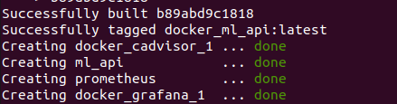
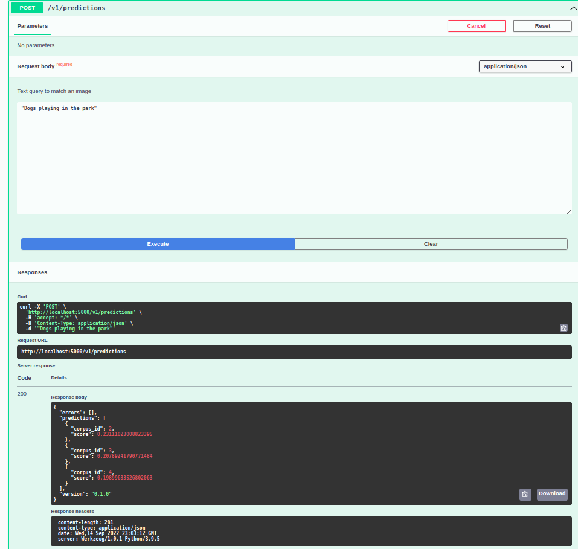
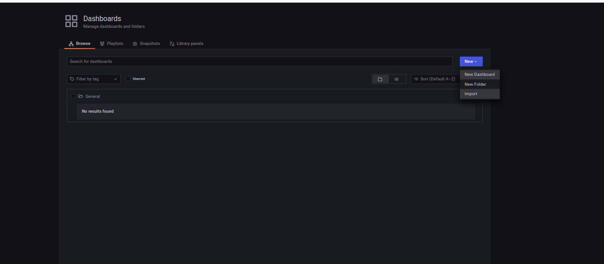
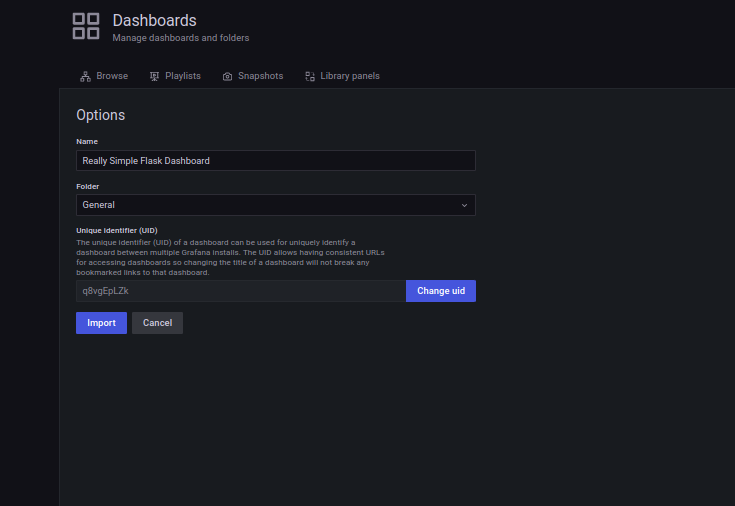
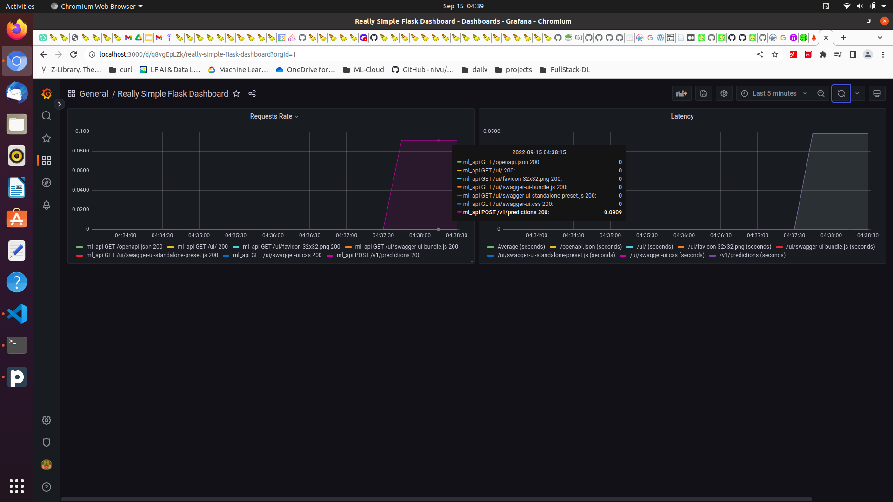
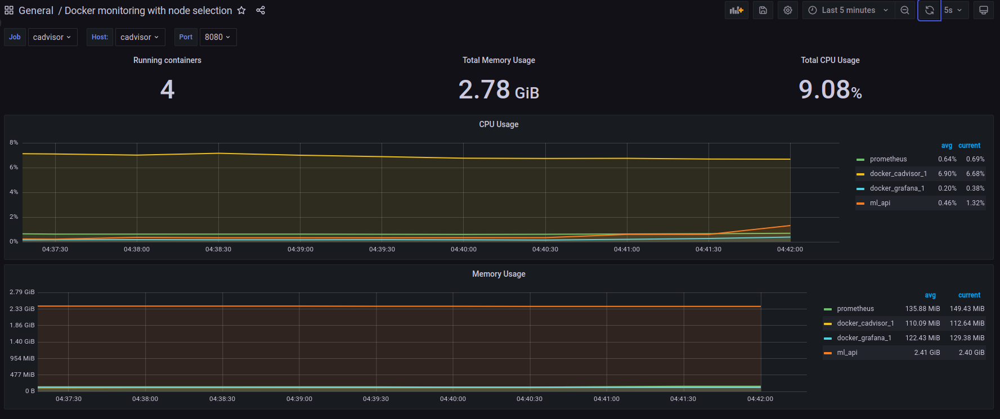
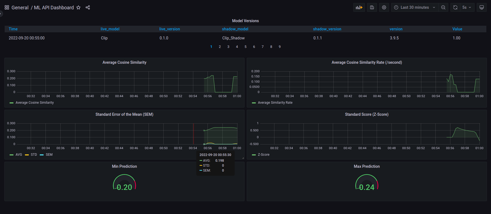

# Local Development Setup

1. Install miniconda
2. Clone code and checkout branch
```
git clone https://github.com/arylwen/fsdl_project.git fsdl_project_docker
cd fsdl_project_docker/ 
git checkout docker_template_exp 
```

3. Use environment.yml file for creating new environment in conda 

```
make conda-update
```

4. Install additional python packages in the newly created conda environment using pip-tools

```
make pip-tools
```

# Running Inference

1. Install semsearch package
```
cd semantic_search
python3 setup.py install
```
2. Understand inference
```
cd ..
#in fsdl_project_docker
jupyter notebook
```
Refer Package-Access jupyter notebook for running inference.

# Running Flask Server
1. Run the server
```
python3 semantic_search/ml_api/run.py to start the Flask Server.
```
2. Goto http://localhost:5000/ui/.
3. Goto POST /v1/predictions endpoint.
4. Click on Try Now and enter text under the section "Text query to match an image"
    For eg. Type "Running dogs" and hit execute.
5.   Response will be generated under the Response Body section below.

## Response

#corpus_id - Pointing to Image Index Number in the preseeded Image Corpus/
#Score - Cosine Similarity
#version - Model version

{
  "errors": [],
  "predictions": [
    {
      "corpus_id": 2,
      "score": 0.237429678440094
    },
    {
      "corpus_id": 3,
      "score": 0.23457613587379456
    },
    {
      "corpus_id": 0,
      "score": 0.19539634883403778
    }
  ],
  "version": "0.1.0"
}


# Docker Setup


## Run the application manually 
  1.  Build Docker Container

```
sudo docker build -f docker/Dockerfile  -t fsdl .
```

  2. Run docker container[bash]

``` 
sudo docker run -it -p 5000:5000 fsdl bash
```

```
sudo docker run -it -p 5000:5000 --name ml_api docker_ml_api bash
```

  3. Run the flask app

```
python3 ml_api/run.py
```
  4. Goto http://localhost:5000/ui/

## Run Using Docker Compose

  1. **Build and Run Docker Containers**
```
sudo docker-compose -f docker/docker-compose.yml up -d --build
```
2. Ensure all 4 docker images are created and running

   


     2. Images corpus will be pulled 
       2. Model will be exposed at ```/v1/predictions``` endpoint.
       2. ```/metric``` endpoint will be exposed for Prometheus server to pull monitoring data.

  2. Go to http://localhost:5000/ui/ and try sending the request by adding a  text query.



7. Ensure you get the response back as shown above in the Response body section.

<u>**Monitoring Metrics with Prometheus**</u>

8. Go to http://localhost:3000/ and login Grafana with username ```admin``` and password ```foobar```
9. In the home dashboard ,click on **Add Datasource** and select **Prometheus**.
10. Under HTTP-> URL section add ```http://prometheus:9090``` and click **Save and Test**. Ensure you get a message saying "Data Source is working".

11. **Monitor Endpoints Metrics**
    1. Go to Dashboards -> Browse -> New -> Import
    
    2. Import dashboard **grafana_flask_basic_dashboard_ml_api.json**" present in our repository from  ```semantic_search/docker/config/grafana/```
    
    3. Dashboard will be loaded which is configured to monitor two metrics : **Request Latency** ,**Latency**
    4. Try sending some requests from  http://localhost:5000/ui/ , the data points will start appearing on the dashboard
    5. 






**<u>Monitor Infrastructure Metrics</u>**

12. Import dashboard **basic_cadvisor_dashboard_ml_api.json**" present in the repository from  ```semantic_search/docker/config/grafana/```

​	

13. **Monitor ML Model Metrics**

14. Import dashboard **ml_api_dashboard.json**" present in the repository from  ```semantic_search/docker/config/grafana/```

    

# Trouble Shooting

1. ```
ERROR: for ml_api  no such image: sha256:c3df073f09547286f8901569a25498cb09a11d94e8e2250c80074d916eee6b90: No such image: sha256:c3df073f09547286f8901569a25498cb09a11d94e8e2250c80074d916eee6b90
ERROR: The image for the service you're trying to recreate has been removed. If you continue, volume data could be lost. Consider backing up your data before continuing.


**Solution** :Remove stopped docker containers
Go to semantic_search/docker and run: ```docker-compose rm```and remove any stopped docker container.


# Docker Commands

##List all docker containers
```
sudo docker container ls --all
```
or
```
sudo docker container -p
```


# References

1. [prometheus_flask_exporter](https://github.com/rycus86/prometheus_flask_exporter)
2. [use-grafana-to-monitor-flask-apps-with-prometheus](https://www.metricfire.com/blog/use-grafana-to-monitor-flask-apps-with-prometheus/)
3. [flask_prometheus_metrics](https://github.com/pilosus/flask_prometheus_metrics)

