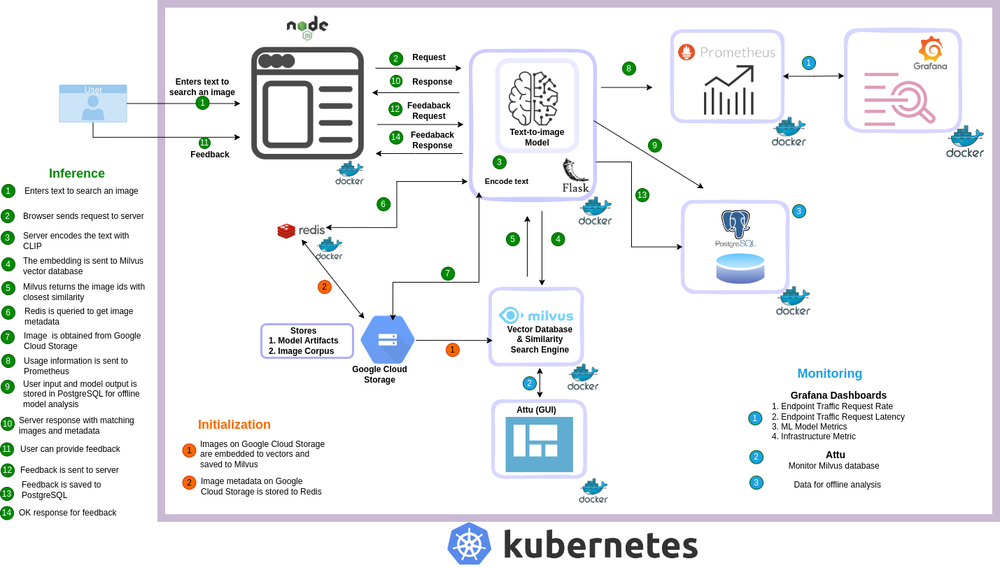

# Semantic Similarity Search Engine with State of the Art Embeddings

## FSDL-2022 PROJECT


        


# System Design




# Key Features

1. Generate Embedding for Text-to-Image Similarity Search using OpenAI Clip Model.
2. Perform Vector Similarity Search using  Milvus Vector Database using Approximate Nearest Neighbour Search.
   1. Read more on [Existing Approaches to Vector Data Management and Search](https://milvus.io/blog/scalable-and-blazing-fast-similarity-search-with-milvus-vector-database.md#Existing-Approaches-to-Vector-Data-Management-and-Search)
3. REST API service using Flask to perform Text-to-Image Search.
4. Search Engine User Interface built using Nodejs to perform Text-to-Image Search.
5. Infrastructure Metric and ML Model Metric collection using Prometheus.
6. Infrastructure Metric and ML Model Metric visualization using Grafana.
7. Store Model Results in PostgreSQL Database for Offline Model Evaluation.
8. Store User Feedback on the Search results using Redis.
9. Data Ingestion Pipeline for Storage of Image Corpus on Google Cloud Storage.
10. Data Migration between Google Store and Milvus Vector Database.
11. Building Container Application for the following services:
    1. Search Engine Backend- [ML Inferece Engine]
    2. Search Engine UI
    3. Prometheus
    4. Grafana
    5. PostgreSQL
    6. Milvus
    7. Attu- GUI for Milvus
    8. Redis
12. Container Orchestrate using Docker-Compose on Single Host Machine.
13. Orchestrate Deployment using Kubernetes on Google Cloud.


## Getting Started

### Install Dependencies

```
# clone project 
git clone https://github.com/u6yuvi/fsdl_project.git fsdl_project
cd fsdl_project/
git checkout docker_template_exp

# create conda environment [fsdl_project]
conda env create -f environment.yml 
conda activate semsearch

#install packages
make pip-tools

```


## Run Semantic Search Engine on Single Host Machine as Container Application

**<u>Step 1 - Start Search Engine Services</u>**

```
cd semantic_search/
sudo docker-compose -f docker/docker-compose.yml up -d --build 
```

Following services will be up and running:

1. Search Inference Engine [ml_api]
2. User Interface[search_ui] 
3. PostgreSQL[database]
4. Redis[db]
5. Prometheus[prometheus]
6. Grafana[grafana]
7. cadvisor[cadvisor]

**<u>Step 2 - Interacting with Search Engine</u>** 

1. Through User Interface[Semsearch UI]
   1. The web page is available at http://localhost:5173/
   2. For more details refer the [link](https://github.com/u6yuvi/fsdl_project/tree/redis_sql/semantic_search/search_ui) .
2. Using Flask OpenAPI to send search requests.
   1. The web page is available at http://localhost:5000/ui


<u>**Step 3 - Interact with Monitoring Services**</u>

1. **Prometheus**
   1. The web page is available at http://localhost:9090
2. **Grafana**
   1. The web page is available at http://localhost:3000
   2. Login Grafana with username ```admin``` and password ```foobar```.


For more detailed user guide refer  ```Introduction.md```


#  FSDL Team

1. Amit Sah
2. Gabriela
3. Kandpallucky
4. Sandhya Govindaraju
5. Utkarsh Vardhan

# Maintainers

- [Gabriela](https://github.com/arylwen)

- [Sandhya Govindaraju](https://github.com/sandhya-sago)
- [Utkarsh Vardhan](https://github.com/u6yuvi) 
