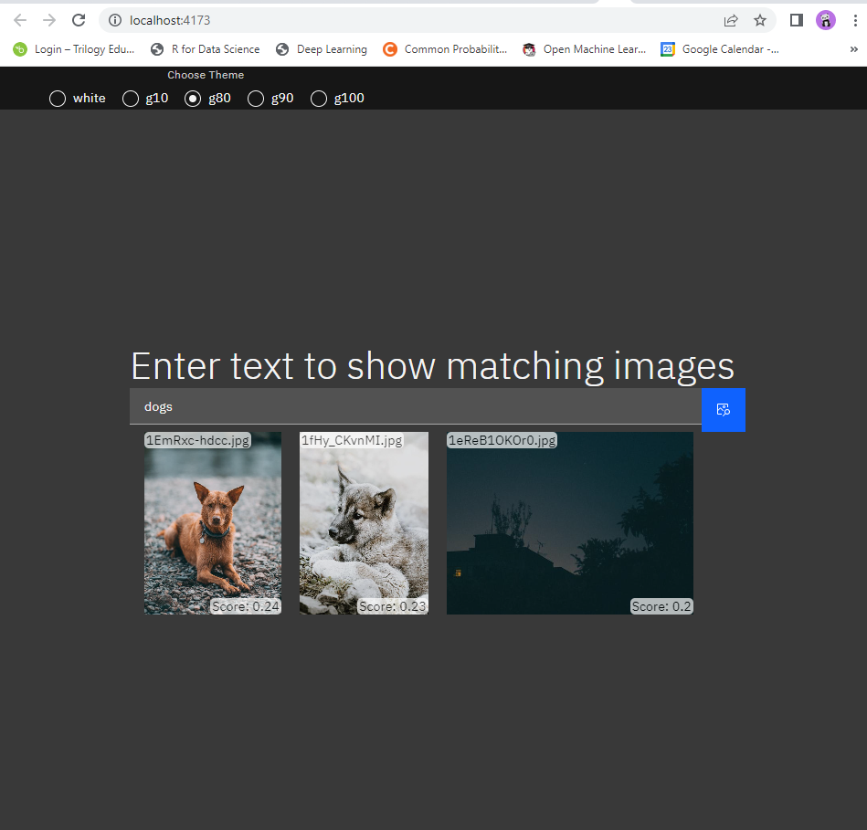

# Search UI

1. Download and install node.js and `npm`
2. From `semantic_search/search_ui`
```shell
npm install
```
3. To run
```shell
npm run dev
```

4. The web page is available at [http://localhost:5173/](http://localhost:5173/)

